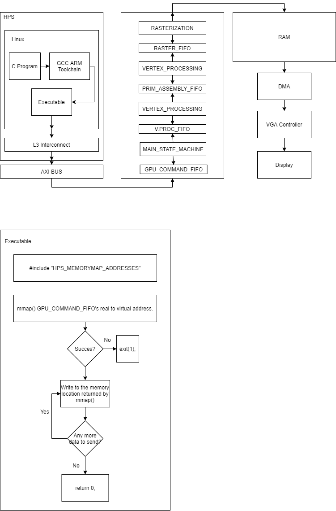

# 3D-Graphics-Pipeline
## **Overview**
High-level diagram of the entire system:

## **Modules**
1. **gpu_qsys_inst.v** - Top level module
2. **gpu_sm.v** - reads commands from the instruction fifo and processes them accordingly.
3. **vert_processing.v** - reads the vertices and transforms them according to the transformation matrix (TM = PROJ x VIEW x MODEL).
3. **prim_assembly.v** - reads vertices from the primitive assembly fifo and relays the data to the rasterization module. Can be used to add support for different geometries besides triangles.
4. **raster.sv** - Reads the vertices of a triangle from the primitive assembly fifo, and using the barycentric coordinates, generates a triangles. The shading is achieved by linear interpolation.

An overview of the Qsys system is shown in [qsys_overview.pdf](qsys_overview.pdf).  
A more in-depth explanation of the system can be found in the [technical manual](documentation/techman.pdf)  

## **Results**

  
Shaded Triangle

 

  
A helix of triangles

 

  
Human face obj model

 

  
Rendering of 100,000 triangles

https://github.com/ddacot/3D-Graphics-Pipeline/blob/main/documentation/results_img/triangles.mp4

